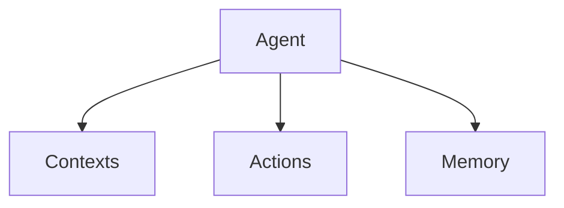

# Axiomkit Documentation

## Overview

This is the official documentation for Axiomkit, a next-generation TypeScript framework for building autonomous AI agents. The documentation is built using Next.js and provides comprehensive guides, API references, and examples.

## Structure

```
docs/
├── content/
│   └── docs/
│       ├── framework/           # Core framework documentation
│       │   ├── architecture/    # Architecture guides
│       │   └── getting-started/ # Getting started guides
│       ├── built-in-providers/ # Extension documentation
│       ├── api/                 # API reference
│       ├── examples/            # Code examples
│       └── sei/                 # SEI blockchain integration
├── components/                  # Documentation components
├── lib/                        # Utility functions
└── public/                     # Static assets
```

## Documentation Sections

### 🏗️ **Framework**
Core concepts and architecture of Axiomkit:
- **Overview**: Introduction to the framework
- **Architecture**: Detailed architecture guides
- **Getting Started**: Quick start and first agent guides

### 🔌 **Built-in providers**
Platform integrations and providers:
- **CLI**: Command-line interface
- **Discord**: Discord bot integration
- **Telegram**: Telegram bot integration
- **MongoDB**: Database integration
- **Supabase**: Cloud database integration

### 📚 **API Reference**
Complete API documentation:
- **Agent**: Agent creation and configuration
- **Context**: Context management
- **Action**: Action definitions
- **Memory**: Memory system
- **Extension**: Extension development
- **Types**: TypeScript types

### 💡 **Examples**
Practical examples and templates:
- **Basic**: Simple examples (Calculator, Echo, Translator)
- **Advanced**: Complex examples (Multi-functional, Debugging)
- **Chat**: Conversation examples
- **Games**: Interactive examples
- **Integrations**: External service examples

### ⛓️ **SEI**
SEI blockchain integration:
- **Overview**: SEI blockchain concepts
- **Integration**: How to use SEI with Axiomkit

## Contributing to Documentation

### Adding New Content

1. **Create New Page**
   ```bash
   # Create a new MDX file
   touch content/docs/section/page-name.mdx
   ```

2. **Add Frontmatter**
   ```mdx
   ---
   title: Page Title
   description: Brief description of the page
   ---
   ```

3. **Update Navigation**
   ```json
   // Update meta.json in the section directory
   {
     "pages": [
       "existing-page",
       "new-page-name"
     ]
   }
   ```

### Documentation Standards

1. **Code Examples**
   - Use TypeScript for all examples
   - Include complete, runnable code
   - Add comments for clarity
   - Test examples before publishing

2. **Structure**
   - Use clear headings (H1, H2, H3)
   - Include overview sections
   - Provide step-by-step instructions
   - Add troubleshooting sections

3. **Language**
   - Write for developers
   - Use clear, concise language
   - Include practical examples
   - Explain concepts thoroughly

### Code Examples

```typescript
// Good: Complete, runnable example
import { createAgent } from "@axiomkit/core";
import { cliExtension } from "@axiomkit/cli";
import { groq } from "@ai-sdk/groq";

const agent = createAgent({
  model: groq("gemma2-9b-it"),
  providers: [cliExtension],
});

await agent.start();
```

### Images and Diagrams

- Use Mermaid for diagrams
- Optimize images for web
- Include alt text for accessibility
- Store in `public/` directory



## Development

### Local Development

```bash
# Install dependencies
pnpm install

# Start development server
pnpm dev

# Build for production
pnpm build

# Start production server
pnpm start
```

### Environment Variables

```bash
# .env.local
NEXT_PUBLIC_SITE_URL=http://localhost:3000
NEXT_PUBLIC_SITE_NAME=Axiomkit Docs
```

### Styling

The documentation uses:
- **Tailwind CSS** for styling
- **shadcn/ui** for components
- **Lucide React** for icons
- **Next.js** for the framework

### Components

Custom components are available in `components/`:
- `ui/` - Reusable UI components
- `mdx/` - MDX-specific components
- `layout/` - Layout components

## Content Guidelines

### Writing Style

1. **Be Clear and Concise**
   - Use simple, direct language
   - Avoid jargon when possible
   - Explain complex concepts step by step

2. **Be Comprehensive**
   - Cover all important aspects
   - Include edge cases
   - Provide troubleshooting guidance

3. **Be Practical**
   - Include real-world examples
   - Show complete code snippets
   - Provide copy-paste solutions

### Code Standards

1. **TypeScript First**
   - Use TypeScript for all examples
   - Include proper type annotations
   - Show type definitions when relevant

2. **Best Practices**
   - Follow Axiomkit conventions
   - Include error handling
   - Show performance considerations

3. **Testing**
   - Test all code examples
   - Verify they work as expected
   - Update when APIs change

### Documentation Structure

1. **Overview Section**
   - What the feature does
   - Why you might use it
   - Quick example

2. **Detailed Guide**
   - Step-by-step instructions
   - Complete examples
   - Configuration options

3. **API Reference**
   - Function signatures
   - Parameter descriptions
   - Return values

4. **Examples**
   - Basic usage
   - Advanced patterns
   - Real-world scenarios

5. **Troubleshooting**
   - Common issues
   - Error messages
   - Solutions

## Maintenance

### Regular Tasks

1. **Update Examples**
   - Test all code examples
   - Update for API changes
   - Add new use cases

2. **Review Content**
   - Check for accuracy
   - Update outdated information
   - Improve clarity

3. **Monitor Issues**
   - Track documentation issues
   - Respond to feedback
   - Plan improvements

### Version Management

1. **Version Tags**
   - Tag documentation versions
   - Maintain changelog
   - Archive old versions

2. **Breaking Changes**
   - Document API changes
   - Provide migration guides
   - Update examples

3. **Release Notes**
   - Document new features
   - List bug fixes
   - Highlight improvements

## Resources

### External Links

- **[Axiomkit GitHub](https://github.com/your-org/axiomkit)** - Source code
- **[Axiomkit NPM](https://npmjs.com/package/@axiomkit/core)** - Package registry
- **[Community Discord](https://discord.gg/axiomkit)** - Community support

### Tools

- **[Next.js](https://nextjs.org/)** - Framework
- **[Tailwind CSS](https://tailwindcss.com/)** - Styling
- **[shadcn/ui](https://ui.shadcn.com/)** - Components
- **[Mermaid](https://mermaid.js.org/)** - Diagrams

### Contributing

We welcome contributions to the documentation! Please:

1. **Fork the repository**
2. **Create a feature branch**
3. **Make your changes**
4. **Test thoroughly**
5. **Submit a pull request**

For major changes, please open an issue first to discuss the proposed changes.

## License

This documentation is licensed under the same license as Axiomkit itself. See the main repository for license details.
