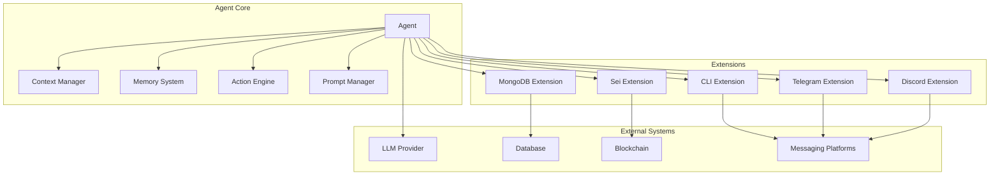

# Agent Architecture

Axiomkit's architecture is designed around the principle of building truly autonomous AI agents with advanced reasoning, memory management, and extensible capabilities.

## Overview

The Axiomkit framework consists of several core components that work together to create intelligent, autonomous agents:



## Core Components

### 1. Agent

The main orchestrator that coordinates all other components:

```typescript
interface Agent<TContext = any> {
  // Core lifecycle methods
  start(args?: StartArgs): Promise<void>;
  stop(): Promise<void>;
  run(options: RunOptions): Promise<RunResult>;
  send(options: SendOptions): Promise<SendResult>;
  
  // Memory management
  memory: MemoryStore;
  
  // Context management
  context: ContextManager;
  
  // Action system
  actions: ActionRegistry;
  
  // Extensions
  extensions: ExtensionRegistry;
}
```

### 2. Context Manager

Handles context creation, validation, and lifecycle:

```typescript
interface Context<TMemory, Schema, Ctx, Actions, Events> {
  type: string;
  schema: z.ZodSchema<Schema>;
  setup?: (args: Schema, settings: any, agent: Agent) => Promise<Ctx>;
  instructions: string;
  examples?: Array<{
    input: string;
    output: string;
  }>;
}
```

### 3. Memory System

Provides persistent and episodic memory capabilities:

```typescript
interface MemoryStore {
  // Episodic memory (conversation history)
  episodes: Episode[];
  
  // Semantic memory (learned knowledge)
  semantic: SemanticMemory;
  
  // Working memory (current session)
  working: WorkingMemory;
  
  // Memory operations
  addEpisode(episode: Episode): Promise<void>;
  getRelevantEpisodes(query: string, limit?: number): Promise<Episode[]>;
  compressMemory(): Promise<void>;
}
```

### 4. Action Engine

Manages custom actions and their execution:

```typescript
interface Action<Schema, Result, TError, TContext, TAgent, TMemory> {
  name: string;
  description: string;
  schema: z.ZodSchema<Schema>;
  handler: (args: Schema, ctx: TContext, agent: TAgent) => Promise<Result>;
}
```

## Agent Lifecycle

### 1. Initialization

```typescript
const agent = createAgent({
  model: groq("gemma2-9b-it"),
  modelSettings: {
    maxTokens: 1000,
    temperature: 0.7,
  },
  memory: {
    enabled: true,
    maxEpisodes: 50,
  },
  actions: [/* custom actions */],
  extensions: [/* extensions */],
});
```

### 2. Startup

```typescript
await agent.start({
  // Optional startup configuration
  initializeMemory: true,
  loadExtensions: true,
  validateConfig: true,
});
```

### 3. Execution

```typescript
const result = await agent.run({
  context: {
    type: "chat",
    instructions: "You are a helpful assistant.",
  },
  args: {
    message: "Hello, how are you?",
    userId: "user123",
  },
  handlers: {
    onLogStream: (log, done) => {
      // Handle streaming logs
    },
    onError: (error) => {
      // Handle errors
    },
  },
});
```

### 4. Shutdown

```typescript
await agent.stop({
  saveMemory: true,
  cleanup: true,
});
```

## Context System

### Context Types

Axiomkit supports multiple context types for different use cases:

#### 1. Chat Context

```typescript
const chatContext = {
  type: "chat",
  schema: z.object({
    userId: z.string(),
    sessionId: z.string(),
    message: z.string(),
  }),
  setup: async (args, settings, agent) => {
    return {
      sessionStart: new Date().toISOString(),
      userHistory: await agent.memory.getUserEpisodes(args.userId),
    };
  },
  instructions: "You are a helpful chat assistant.",
};
```

#### 2. Task Context

```typescript
const taskContext = {
  type: "task",
  schema: z.object({
    taskId: z.string(),
    taskType: z.enum(["calculation", "analysis", "generation"]),
    parameters: z.record(z.any()),
  }),
  setup: async (args, settings, agent) => {
    return {
      taskStart: new Date().toISOString(),
      taskHistory: await agent.memory.getTaskHistory(args.taskId),
    };
  },
  instructions: "You are a task execution agent.",
};
```

#### 3. Multi-Agent Context

```typescript
const multiAgentContext = {
  type: "multi_agent",
  schema: z.object({
    agentId: z.string(),
    coordinatorId: z.string(),
    task: z.string(),
    collaborators: z.array(z.string()),
  }),
  setup: async (args, settings, agent) => {
    return {
      collaborationStart: new Date().toISOString(),
      agentRole: await determineRole(args.agentId, args.task),
    };
  },
  instructions: "You are part of a multi-agent system.",
};
```

## Memory Architecture

### Memory Types

#### 1. Episodic Memory

Stores conversation history and interactions:

```typescript
interface Episode {
  id: string;
  timestamp: Date;
  context: string;
  input: any;
  output: any;
  metadata: {
    userId?: string;
    sessionId?: string;
    taskId?: string;
    performance?: number;
  };
}
```

#### 2. Semantic Memory

Stores learned knowledge and patterns:

```typescript
interface SemanticMemory {
  concepts: Map<string, Concept>;
  patterns: Map<string, Pattern>;
  relationships: Map<string, Relationship[]>;
  
  addConcept(concept: Concept): Promise<void>;
  findSimilarConcepts(query: string): Promise<Concept[]>;
  updateRelationships(conceptId: string, relationships: Relationship[]): Promise<void>;
}
```

#### 3. Working Memory

Manages current session state:

```typescript
interface WorkingMemory {
  currentContext: any;
  activeGoals: Goal[];
  attention: Attention[];
  pressure: number; // 0-1, indicates memory pressure
  
  addGoal(goal: Goal): void;
  updateAttention(focus: Attention): void;
  checkPressure(): boolean;
}
```

### Memory Management Strategies

#### 1. LRU (Least Recently Used)

```typescript
const agent = createAgent({
  memory: {
    enabled: true,
    maxEpisodes: 100,
    pruningStrategy: "lru",
    compressionEnabled: true,
  },
});
```

#### 2. Importance-Based

```typescript
const agent = createAgent({
  memory: {
    enabled: true,
    maxEpisodes: 100,
    pruningStrategy: "importance",
    importanceFunction: (episode) => {
      // Custom importance calculation
      return episode.metadata.performance || 0.5;
    },
  },
});
```

## Action System

### Custom Actions

Actions allow agents to perform specific tasks:

```typescript
import { z } from "zod";

const searchAction = {
  name: "web_search",
  description: "Search the web for information",
  schema: z.object({
    query: z.string(),
    maxResults: z.number().optional().default(5),
  }),
  handler: async (args, ctx, agent) => {
    // Implement web search logic
    const results = await performWebSearch(args.query, args.maxResults);
    return { results };
  },
};

const calculatorAction = {
  name: "calculate",
  description: "Perform mathematical calculations",
  schema: z.object({
    expression: z.string(),
    precision: z.number().optional().default(2),
  }),
  handler: async (args, ctx, agent) => {
    const result = evaluateExpression(args.expression);
    return { 
      result: Number(result.toFixed(args.precision)),
      expression: args.expression,
    };
  },
};
```

### Action Chaining

Actions can be chained together for complex workflows:

```typescript
const workflowAction = {
  name: "research_workflow",
  description: "Research a topic and generate a report",
  schema: z.object({
    topic: z.string(),
    depth: z.enum(["shallow", "medium", "deep"]),
  }),
  handler: async (args, ctx, agent) => {
    // Step 1: Search for information
    const searchResult = await agent.executeAction("web_search", {
      query: args.topic,
      maxResults: 10,
    });
    
    // Step 2: Analyze the information
    const analysisResult = await agent.executeAction("analyze_text", {
      text: searchResult.results.join("\n"),
      analysisType: "summary",
    });
    
    // Step 3: Generate report
    const reportResult = await agent.executeAction("generate_report", {
      topic: args.topic,
      analysis: analysisResult.summary,
      depth: args.depth,
    });
    
    return {
      topic: args.topic,
      searchResults: searchResult.results,
      analysis: analysisResult.summary,
      report: reportResult.report,
    };
  },
};
```

## Extension System

### Extension Types

#### 1. CLI Extension

```typescript
import { createCliExtension } from "@axiomkit/cli";

const cliExtension = createCliExtension({
  name: "assistant",
  instructions: [
    "You are a helpful command-line assistant.",
    "Help users with their questions and tasks.",
  ],
  examples: [
    {
      input: "How do I install Node.js?",
      output: "You can install Node.js by...",
    },
  ],
});
```

#### 2. Telegram Extension

```typescript
import { createTelegramExtension } from "@axiomkit/telegram";

const telegramExtension = createTelegramExtension({
  token: process.env.TELEGRAM_TOKEN,
  commands: {
    start: "Welcome to the bot!",
    help: "Available commands: /start, /help, /chat",
  },
  handlers: {
    onMessage: async (message, agent) => {
      const result = await agent.run({
        context: { type: "telegram", userId: message.from.id },
        args: { message: message.text },
      });
      return result.output;
    },
  },
});
```

#### 3. MongoDB Extension

```typescript
import { createMongoDBExtension } from "@axiomkit/mongodb";

const mongoExtension = createMongoDBExtension({
  uri: process.env.MONGODB_URI,
  database: "axiomkit",
  collections: {
    episodes: "episodes",
    semantic: "semantic_memory",
    users: "users",
  },
});
```

## Performance Optimization

### 1. Memory Optimization

```typescript
const agent = createAgent({
  memory: {
    enabled: true,
    maxEpisodes: 100,
    compressionEnabled: true,
    compressionThreshold: 0.8, // Compress when 80% full
    pruningStrategy: "lru",
  },
});
```

### 2. Request Tracking

```typescript
const agent = createAgent({
  requestTrackingConfig: {
    enabled: true,
    trackTokens: true,
    trackLatency: true,
    trackCosts: true,
    exportMetrics: true,
  },
});
```

### 3. Streaming Responses

```typescript
const result = await agent.run({
  context: chatContext,
  args: { message: "Tell me a story" },
  handlers: {
    onLogStream: (log, done) => {
      if (log.ref === "thought") {
        console.log("🤔 Thinking:", log.content);
      }
      if (log.ref === "output") {
        console.log("💬 Response:", log.content);
      }
    },
  },
});
```

## Best Practices

### 1. Context Design

- Keep contexts focused and specific
- Use proper schema validation
- Include relevant examples
- Design for reusability

### 2. Memory Management

- Set appropriate memory limits
- Use compression for large datasets
- Implement proper pruning strategies
- Monitor memory pressure

### 3. Action Design

- Make actions atomic and focused
- Provide clear descriptions
- Use proper error handling
- Validate inputs thoroughly

### 4. Extension Development

- Follow the extension interface
- Handle errors gracefully
- Provide clear documentation
- Test thoroughly

## Next Steps

Explore these advanced topics to deepen your understanding:

<Cards>
  <Card title="Context Management" href="/docs/context" />
  <Card title="Memory Management" href="/docs/memory" />
  <Card title="Custom Actions" href="/docs/actions" />
  <Card title="Extensions" href="/docs/extensions" />
</Cards>
