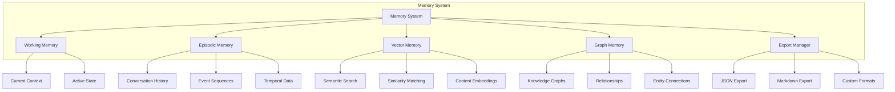

# Memory System

## Overview

Axiomkit's memory system is a sophisticated multi-layered architecture that enables agents to maintain context, learn from experiences, and provide personalized interactions. Unlike simple key-value storage, it provides structured, semantic, and relationship-based memory capabilities.

## Memory Architecture



## Memory Types

### 🧠 Working Memory
Short-term storage for active conversations and immediate context.

**Characteristics:**
- **Temporary**: Cleared when context ends
- **Fast Access**: In-memory for quick retrieval
- **Context-Specific**: Isolated per conversation

```typescript
// Working memory example
const workingMemory = {
  currentConversation: {
    messages: [
      { role: "user", content: "What's the weather like?" },
      { role: "agent", content: "I'll check for you." },
      { action: "getWeather", result: "Sunny, 72°F" }
    ],
    activeTask: "weather_inquiry",
    context: { location: "New York", time: "2024-01-15T10:30:00Z" }
  }
};
```

### 📚 Episodic Memory
Long-term storage of conversations, experiences, and events with temporal organization.

**Characteristics:**
- **Persistent**: Survives across sessions
- **Temporal**: Organized by time and sequence
- **Structured**: Captures situations, actions, and outcomes

```typescript
// Episodic memory example
const episodicMemory = [
  {
    id: "episode_001",
    timestamp: "2024-01-15T10:30:00Z",
    situation: "User asked about weather in New York",
    action: "Called weather API",
    outcome: "Provided accurate weather information",
    lesson: "User prefers detailed weather reports",
    metadata: {
      location: "New York",
      weatherCondition: "sunny",
      userSatisfaction: "high"
    }
  }
];
```

### 🔍 Vector Memory
Semantic storage enabling similarity-based retrieval and search.

**Characteristics:**
- **Semantic**: Content-based similarity matching
- **Scalable**: Handles large amounts of data
- **Flexible**: Supports various content types

```typescript
// Vector memory example
const vectorMemory = {
  embeddings: [
    {
      id: "doc_001",
      content: "Weather API documentation",
      embedding: [0.1, 0.2, 0.3, ...],
      metadata: { type: "api_doc", category: "weather" }
    }
  ],
  searchIndex: "vector_index_001"
};
```

### 🕸️ Graph Memory
Relationship-based storage for complex knowledge graphs and connections.

**Characteristics:**
- **Relational**: Captures entity relationships
- **Queryable**: Supports complex graph queries
- **Expandable**: Grows with knowledge

```typescript
// Graph memory example
const graphMemory = {
  nodes: [
    { id: "user_001", type: "user", properties: { name: "John", preferences: ["weather"] } },
    { id: "weather_api", type: "service", properties: { name: "OpenWeatherMap" } },
    { id: "new_york", type: "location", properties: { name: "New York", country: "USA" } }
  ],
  edges: [
    { from: "user_001", to: "weather_api", type: "uses", weight: 0.8 },
    { from: "user_001", to: "new_york", type: "located_in", weight: 1.0 }
  ]
};
```

## Setting Up Memory

### Basic Memory Configuration

```typescript
import { createAgent, MemorySystem } from "@axiomkit/core";
import { InMemoryKeyValueProvider, InMemoryVectorProvider, InMemoryGraphProvider } from "@axiomkit/core";

const memory = new MemorySystem({
  providers: {
    // Episodic memory for conversation history
    episodic: new InMemoryKeyValueProvider(),
    
    // Vector memory for semantic search
    vector: new InMemoryVectorProvider(),
    
    // Graph memory for relationships
    graph: new InMemoryGraphProvider(),
  },
  
  // Memory configuration
  config: {
    maxEpisodes: 1000,
    vectorDimensions: 1536,
    graphMaxNodes: 10000,
  }
});

const agent = createAgent({
  model: groq("gemma2-9b-it"),
  memory,
  extensions: [cliExtension],
});
```

### Advanced Memory with External Providers

```typescript
import { MemorySystem } from "@axiomkit/core";
import { MongoDBProvider } from "@axiomkit/mongodb";
import { SupabaseProvider } from "@axiomkit/supabase";

const memory = new MemorySystem({
  providers: {
    // MongoDB for episodic memory
    episodic: new MongoDBProvider({
      connectionString: process.env.MONGODB_URI,
      database: "agent_memory",
      collection: "episodes"
    }),
    
    // Supabase for vector memory
    vector: new SupabaseProvider({
      url: process.env.SUPABASE_URL,
      key: process.env.SUPABASE_KEY,
      table: "vector_memory"
    }),
    
    // In-memory graph for relationships
    graph: new InMemoryGraphProvider(),
  },
});
```

## Memory Operations

### Storing Information

```typescript
// Store in working memory (automatic)
const context = await agent.run({
  context: userContext,
  args: { userId: "user_123" },
  input: "What's the weather like?"
});

// Store in episodic memory
await memory.episodic.store({
  id: "episode_001",
  data: {
    situation: "Weather inquiry",
    action: "API call to weather service",
    outcome: "Provided weather information",
    timestamp: new Date(),
    metadata: { location: "New York", temperature: "72°F" }
  }
});

// Store in vector memory
await memory.vector.store({
  id: "weather_doc_001",
  content: "Weather API documentation and usage examples",
  metadata: { type: "documentation", category: "weather" }
});

// Store in graph memory
await memory.graph.store({
  nodes: [
    { id: "user_123", type: "user", properties: { name: "John" } },
    { id: "weather_service", type: "service", properties: { name: "OpenWeatherMap" } }
  ],
  edges: [
    { from: "user_123", to: "weather_service", type: "uses", weight: 0.8 }
  ]
});
```

### Retrieving Information

```typescript
// Retrieve from episodic memory
const episodes = await memory.episodic.query({
  filter: { userId: "user_123" },
  limit: 10,
  sort: { timestamp: "desc" }
});

// Semantic search in vector memory
const similarDocs = await memory.vector.search({
  query: "weather API usage",
  limit: 5,
  threshold: 0.7
});

// Graph queries
const userConnections = await memory.graph.query({
  nodeId: "user_123",
  relationship: "uses",
  depth: 2
});
```

### Memory Export

```typescript
import { ExportManager, JSONExporter, MarkdownExporter } from "@axiomkit/core";

const exportManager = new ExportManager({
  exporters: {
    json: new JSONExporter(),
    markdown: new MarkdownExporter(),
  }
});

// Export all memory
const exportData = await exportManager.export({
  memory,
  format: "json",
  include: ["episodic", "vector", "graph"]
});

// Export specific memory types
const episodicExport = await exportManager.export({
  memory,
  format: "markdown",
  include: ["episodic"]
});
```

## Memory Best Practices

### 1. **Structured Data Storage**
```typescript
// Good: Structured episodic memory
await memory.episodic.store({
  id: "episode_001",
  data: {
    situation: "User requested weather information",
    action: "Called OpenWeatherMap API",
    outcome: "Successfully provided weather data",
    lesson: "User prefers detailed weather reports",
    metadata: {
      location: "New York",
      temperature: "72°F",
      conditions: "sunny"
    }
  }
});

// Avoid: Unstructured data
await memory.episodic.store({
  id: "episode_001",
  data: "User asked about weather, I checked it, it was sunny"
});
```

### 2. **Semantic Search Optimization**
```typescript
// Good: Rich content for vector memory
await memory.vector.store({
  id: "weather_api_doc",
  content: "Comprehensive guide to weather API integration including authentication, endpoints, and error handling",
  metadata: {
    type: "documentation",
    category: "api",
    tags: ["weather", "integration", "authentication"]
  }
});

// Avoid: Minimal content
await memory.vector.store({
  id: "weather_api_doc",
  content: "Weather API",
  metadata: {}
});
```

### 3. **Graph Relationship Design**
```typescript
// Good: Meaningful relationships
await memory.graph.store({
  nodes: [
    { id: "user_123", type: "user", properties: { name: "John", role: "developer" } },
    { id: "weather_api", type: "service", properties: { name: "OpenWeatherMap", category: "weather" } },
    { id: "new_york", type: "location", properties: { name: "New York", country: "USA" } }
  ],
  edges: [
    { from: "user_123", to: "weather_api", type: "frequently_uses", weight: 0.9 },
    { from: "user_123", to: "new_york", type: "located_in", weight: 1.0 },
    { from: "weather_api", to: "new_york", type: "provides_data_for", weight: 0.8 }
  ]
});
```

### 4. **Memory Cleanup**
```typescript
// Configure automatic cleanup
const memory = new MemorySystem({
  providers: {
    episodic: new InMemoryKeyValueProvider(),
    vector: new InMemoryVectorProvider(),
    graph: new InMemoryGraphProvider(),
  },
  config: {
    // Clean up old episodes
    maxEpisodes: 1000,
    episodeRetentionDays: 30,
    
    // Limit vector storage
    maxVectorDocuments: 10000,
    
    // Graph size limits
    maxGraphNodes: 10000,
    maxGraphEdges: 50000,
  }
});
```

## Memory Providers

Axiomkit supports multiple memory providers for different use cases:

### Built-in Providers
- **InMemory**: Fast, temporary storage for development
- **FileSystem**: Persistent local storage
- **MongoDB**: Scalable document storage
- **Supabase**: Cloud-based vector and relational storage

### Custom Providers
```typescript
import { MemoryProvider } from "@axiomkit/core";

class CustomMemoryProvider implements MemoryProvider {
  async store(id: string, data: any): Promise<void> {
    // Custom storage logic
  }
  
  async retrieve(id: string): Promise<any> {
    // Custom retrieval logic
  }
  
  async query(filter: any): Promise<any[]> {
    // Custom query logic
  }
}
```

## Performance Considerations

### Memory Optimization
- **Lazy Loading**: Load memories only when needed
- **Caching**: Cache frequently accessed memories
- **Compression**: Compress large memory objects
- **Indexing**: Use proper indexes for fast queries

### Scalability
- **Sharding**: Distribute memory across multiple instances
- **Replication**: Replicate critical memories for reliability
- **Monitoring**: Track memory usage and performance metrics

This comprehensive memory system enables Axiomkit agents to maintain rich, contextual awareness and provide truly intelligent, personalized interactions.


