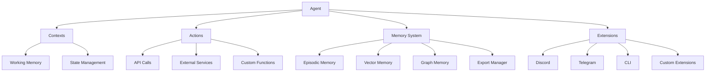

## What is Axiomkit?

**Axiomkit** is a next-generation TypeScript framework for building autonomous AI agents with advanced memory, reasoning, and action capabilities. It provides a comprehensive toolkit for creating intelligent systems that can:

* **Think and Reason** - Use powerful language models to analyze, plan, and make decisions
* **Remember and Learn** - Maintain structured memory across conversations and sessions
* **Act and Interact** - Execute actions, call APIs, and interact with external systems
* **Adapt and Scale** - Grow from simple scripts to complex production systems

## Core Philosophy

Axiomkit is built on the principle that AI agents should be **composable**, **extensible**, and **developer-friendly**. Every component is designed to work together seamlessly while remaining independently useful.

## Key Features

### 🧠 **Advanced Memory System**
- **Working Memory**: Short-term context for active conversations
- **Episodic Memory**: Long-term storage of conversations and experiences
- **Vector Memory**: Semantic search across historical data
- **Graph Memory**: Relationship-based knowledge storage
- **Export Capabilities**: Export memories in JSON, Markdown, and other formats

### 🔧 **Modular Architecture**
- **Contexts**: Isolated state containers for different domains
- **Actions**: Typed function interfaces for external interactions
- **Extensions**: Pluggable modules for platforms (Discord, Telegram, CLI)
- **Services**: Dependency injection for external resources

### 🎯 **Type Safety**
- Full TypeScript support with comprehensive type inference
- Zod schemas for runtime validation
- IntelliSense support for all components

### 🚀 **Production Ready**
- Built-in logging and debugging tools
- Error handling and recovery mechanisms
- Scalable architecture for high-load scenarios
- Comprehensive testing utilities

## Architecture Overview



## Quick Start

```typescript
import { createAgent } from "@axiomkit/core";
import { cliExtension } from "@axiomkit/cli";
import { groq } from "@ai-sdk/groq";

const agent = createAgent({
  model: groq("gemma2-9b-it"),
  extensions: [cliExtension],
});

await agent.start();
```

## Package Structure

| Package | Purpose | Description |
|---------|---------|-------------|
| `@axiomkit/core` | Core Framework | Main agent runtime, memory system, and utilities |
| `@axiomkit/cli` | CLI Extension | Command-line interface for agents |
| `@axiomkit/discord` | Discord Integration | Discord bot functionality |
| `@axiomkit/telegram` | Telegram Integration | Telegram bot functionality |
| `@axiomkit/mongodb` | MongoDB Memory | MongoDB-based memory storage |
| `@axiomkit/supabase` | Supabase Integration | Supabase database and vector storage |
| `@axiomkit/mcp` | Model Context Protocol | MCP server and client utilities |
| `@axiomkit/sei` | SEI Blockchain | SEI blockchain integration |
| `@axiomkit/create-agent` | Project Scaffolding | CLI tool for creating new agents |

## Use Cases

### 🤖 **Conversational AI**
- Customer support bots with memory
- Personal assistants with context awareness
- Multi-turn conversation systems

### 🔧 **Automation & Integration**
- API orchestration and workflow automation
- Data processing and analysis pipelines
- System monitoring and alerting

### 🎮 **Gaming & Entertainment**
- Interactive storytelling agents
- Game NPCs with persistent memory
- Social media content management

### 💼 **Business Applications**
- Sales and marketing automation
- Document processing and analysis
- Decision support systems

## Getting Started

1. **Install Axiomkit**: `pnpm add @axiomkit/core`
2. **Choose Extensions**: Add platform-specific extensions as needed
3. **Configure Memory**: Set up your preferred memory storage
4. **Define Actions**: Create typed actions for your use case
5. **Deploy**: Run your agent with full production capabilities

## Community & Support

- **Documentation**: Comprehensive guides and API reference
- **Examples**: Real-world examples and templates
- **GitHub**: Open source with active development
- **Discord**: Community discussions and support

Ready to build your first AI agent? Start with our [Quick Start Guide](/docs/framework/getting-started/quick-start) or explore the [Architecture](/docs/framework/architecture) to understand the core concepts.
