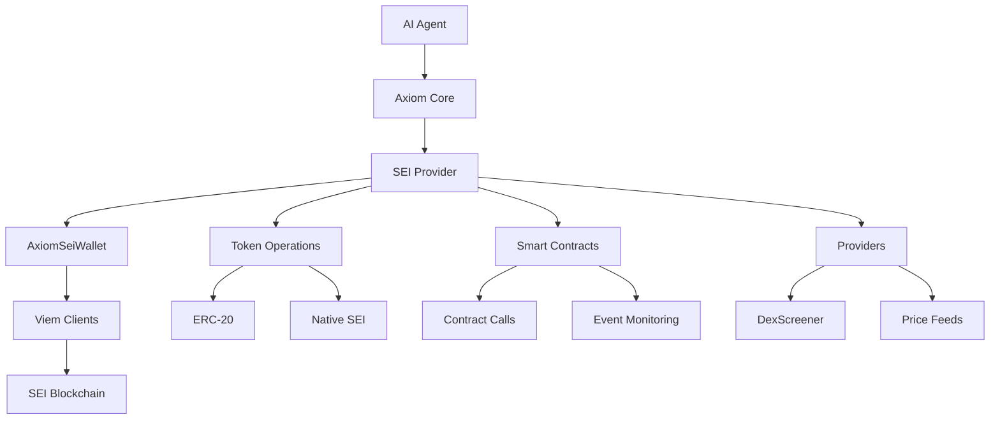

# @axiomkit/sei

The SEI provider for Axiom enables you to create AI agents that can interact with the SEI blockchain ecosystem. Build intelligent Web3 applications that can manage wallets, execute token operations, interact with smart contracts, and integrate with DeFi protocols.

## What is SEI?

SEI is a high-performance Layer 1 blockchain optimized for trading and DeFi applications. It features:

- ⚡ **Ultra-fast finality** - Sub-second transaction confirmation
- 🔄 **EVM compatibility** - Deploy Ethereum smart contracts seamlessly  
- 💰 **Built-in order matching** - Native DEX infrastructure
- 🌐 **Cosmos ecosystem** - Interoperable with IBC networks

## Why Use Axiom with SEI?

Combine the power of AI with SEI's trading-optimized infrastructure:

- 🤖 **Intelligent Trading Bots** - AI agents that can analyze markets and execute trades
- 💼 **Automated Portfolio Management** - Smart agents that rebalance and optimize holdings
- 🛡️ **Risk Management** - Intelligent agents that monitor positions and execute safety measures

## Key Features

### 🏦 **Wallet Management**
- Secure private key handling
- Balance monitoring and alerts
- Transaction history tracking

### 💎 **Token Operations**
- Native SEI token transfers
- ERC-20 token interactions
- Token discovery via DexScreener
- Balance queries and formatting

### 📜 **Smart Contract Integration**
- Read contract state
- Execute contract methods
- Event monitoring
- Gas optimization

### 🔌 **Provider Integrations**
- DexScreener API for token data
- Price feeds and market data
- DEX integration capabilities
- Cross-chain bridge support

## Architecture Overview



## Supported Networks

| Network | Chain ID | RPC URL | Status |
|---------|----------|---------|--------|
| **SEI Mainnet** | `1329` | `https://evm-rpc.sei-apis.com/` | ✅ Production |
| **SEI Testnet** | `1328` | `https://evm-rpc-testnet.sei-apis.com/` | ✅ Testing |
| **SEI Devnet** | `1327` | `https://evm-rpc-devnet.sei-apis.com/` | 🧪 Development |

## Installation

```bash
# Install the SEI provider
pnpm add @axiomkit/sei

# Install required dependencies
pnpm add viem @sei-js/evm
```

## Quick Example

Here's a simple agent that checks your SEI balance:

```typescript
import { createAgent, context, action } from "@axiomkit/core";
import { AxiomSeiWallet } from "@axiomkit/sei";
import { groq } from "@ai-sdk/groq";
import { z } from "zod";

// Initialize SEI wallet
const seiWallet = new AxiomSeiWallet({
  rpcUrl: "https://evm-rpc.sei-apis.com/",
  privateKey: "0x...", // Your private key
});

// Create SEI context with balance checking action
const seiContext = context({
  type: "sei-wallet",
  schema: z.object({
    walletAddress: z.string(),
  }),
  actions: [
    action({
      name: "check-balance",
      description: "Check the SEI balance of the wallet",
      schema: z.object({}),
      handler: async () => {
        const balance = await seiWallet.getERC20Balance();
        return `Your SEI balance is: ${balance} SEI`;
      },
    }),
  ],
});

// Create the agent
const agent = createAgent({
  model: groq("gemma2-9b-it"),
  contexts: [seiContext],
});

// Use the agent
await agent.start();
const response = await agent.send({
  context: seiContext,
  args: { walletAddress: "0x..." },
  input: { type: "text", data: { text: "What's my SEI balance?" } },
});
```

## What's Next?

Ready to build your SEI AI agent? Follow these guides:

### 🚀 [Quick Start Guide](/docs/sei/quick-start)
Get up and running with your first SEI agent in minutes.

### 💼 [Wallet Management](/docs/sei/wallet-management)  
Learn how to securely manage wallets and handle private keys.

### 💎 [Token Operations](/docs/sei/token-operations)
Master SEI and ERC-20 token transfers, balance queries, and token discovery.

### 📜 [Smart Contracts](/docs/sei/smart-contracts)
Interact with smart contracts, read state, and execute methods.

### 🔌 [MCP Context Integration](/docs/sei/mcp-context)
Build SEI AI agents using Model Context Protocol for standardized blockchain interactions.

### 🔌 [Providers & Integrations](/docs/sei/providers-integrations)
Integrate with DexScreener, price feeds, and other SEI ecosystem services.

### 📚 [Examples](/docs/sei/examples)
Real-world examples and use cases for SEI AI agents.

## Community & Support

- 💬 [Discord Community](https://discord.gg/axiomkit) - Get help and share projects
- 📖 [GitHub Repository](https://github.com/axiomkit/axiomkit) - Source code and issues
- 🐦 [Twitter](https://twitter.com/axiomkit) - Latest updates and announcements

---

**Ready to build the future of Web3 AI?** Start with our [Quick Start Guide](/docs/sei/quick-start) and create your first SEI agent today!
