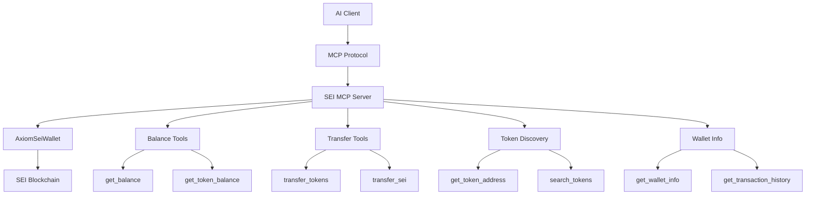

# SEI MCP Context Integration

The SEI MCP (Model Context Protocol) integration allows you to create AI agents that can interact with the SEI blockchain through standardized MCP tools. This approach provides a clean, protocol-based interface for blockchain operations that can be used across different AI platforms and clients.

## What is MCP?

Model Context Protocol (MCP) is a standard for connecting AI assistants to external data sources and tools. It provides:

- **Standardized Interface**: Consistent API for AI tools across platforms
- **Tool Discovery**: Automatic discovery of available capabilities
- **Type Safety**: Strong typing for all tool parameters and responses
- **Cross-Platform**: Works with Claude Desktop, custom clients, and more

## SEI MCP Architecture



## Available MCP Tools

The SEI MCP server provides the following tools:

### 🏦 **Balance Management**
- `get_balance` - Get SEI or ERC-20 token balance
- `get_wallet_info` - Get comprehensive wallet information

### 💸 **Token Operations**
- `transfer_tokens` - Transfer SEI or ERC-20 tokens
- `get_token_address` - Get token contract address from ticker

### 🔍 **Token Discovery**
- `search_tokens` - Search for tokens by name or symbol
- `get_token_info` - Get detailed token information

## Quick Start

### 1. Install Dependencies

```bash
# Install required packages
pnpm add @axiomkit/sei @axiomkit/mcp @modelcontextprotocol/sdk
pnpm add viem @sei-js/evm zod
```

### 2. Environment Setup

Create a `.env` file with your SEI configuration:

```bash
# .env
SEI_RPC_URL=https://evm-rpc.sei-apis.com/
SEI_PRIVATE_KEY=0x... # Your private key (with 0x prefix)
```

### 3. Basic MCP Server

Create a simple SEI MCP server:

```typescript
// mcp-sei-server.ts
import { McpServer } from "@modelcontextprotocol/sdk/server/mcp.js";
import { StdioServerTransport } from "@modelcontextprotocol/sdk/server/stdio.js";
import { z } from "zod";
import { AxiomSeiWallet } from "@axiomkit/sei";
import { validateEnv } from "@axiomkit/core";

// Validate environment
const env = validateEnv(
  z.object({
    SEI_RPC_URL: z.string().min(1),
    SEI_PRIVATE_KEY: z.string().min(1),
  })
);

// Initialize SEI wallet
const wallet = new AxiomSeiWallet({
  rpcUrl: env.SEI_RPC_URL,
  privateKey: env.SEI_PRIVATE_KEY as `0x${string}`,
});

// Create MCP server
const server = new McpServer(
  {
    name: "sei-blockchain-server",
    version: "1.0.0",
  },
  {
    capabilities: {
      tools: {},
    },
  }
);

// Define tools
server.setRequestHandler("tools/list", async () => ({
  tools: [
    {
      name: "get_balance",
      description: "Get SEI or ERC-20 token balance",
      inputSchema: {
        type: "object",
        properties: {
          token: {
            type: "string",
            description: "Token ticker symbol (e.g., 'SEI', 'USDC'). Leave empty for native SEI",
            default: "SEI",
          },
        },
      },
    },
    {
      name: "transfer_tokens",
      description: "Transfer SEI or ERC-20 tokens",
      inputSchema: {
        type: "object",
        properties: {
          amount: {
            type: "string",
            description: "Amount to transfer (e.g., '1.5')",
          },
          recipient: {
            type: "string",
            description: "Recipient wallet address",
          },
          token: {
            type: "string",
            description: "Token ticker symbol (default: SEI)",
            default: "SEI",
          },
        },
        required: ["amount", "recipient"],
      },
    },
    {
      name: "get_token_address",
      description: "Get token contract address from ticker symbol",
      inputSchema: {
        type: "object",
        properties: {
          ticker: {
            type: "string",
            description: "Token ticker symbol (e.g., 'USDC', 'WETH')",
          },
        },
        required: ["ticker"],
      },
    },
    {
      name: "get_wallet_info",
      description: "Get wallet address and SEI balance",
      inputSchema: {
        type: "object",
        properties: {},
      },
    },
  ],
}));

// Handle tool calls
server.setRequestHandler("tools/call", async (request) => {
  const { name, arguments: args } = request.params;

  try {
    switch (name) {
      case "get_balance": {
        const token = args.token || "SEI";
        
        if (token === "SEI") {
          const balance = await wallet.getERC20Balance();
          return {
            content: [
              {
                type: "text",
                text: `Your SEI balance is: ${balance} SEI`,
              },
            ],
          };
        } else {
          const tokenAddress = await wallet.getTokenAddressFromTicker(token);
          if (!tokenAddress) {
            return {
              content: [
                {
                  type: "text",
                  text: `Token '${token}' not found on SEI`,
                },
              ],
            };
          }
          
          const balance = await wallet.getERC20Balance(tokenAddress);
          return {
            content: [
              {
                type: "text",
                text: `Your ${token} balance is: ${balance} ${token}`,
              },
            ],
          };
        }
      }

      case "transfer_tokens": {
        const { amount, recipient, token = "SEI" } = args;
        
        // Validate recipient address
        if (!recipient.startsWith("0x") || recipient.length !== 42) {
          return {
            content: [
              {
                type: "text",
                text: "Invalid recipient address format",
              },
            ],
          };
        }

        const result = await wallet.ERC20Transfer(
          amount,
          recipient as `0x${string}`,
          token === "SEI" ? undefined : token
        );

        return {
          content: [
            {
              type: "text",
              text: `Transfer successful! ${result}`,
            },
          ],
        };
      }

      case "get_token_address": {
        const { ticker } = args;
        const address = await wallet.getTokenAddressFromTicker(ticker);
        
        if (!address) {
          return {
            content: [
              {
                type: "text",
                text: `Token '${ticker}' not found on SEI`,
              },
            ],
          };
        }

        return {
          content: [
            {
              type: "text",
              text: `Token: ${ticker}\nAddress: ${address}`,
            },
          ],
        };
      }

      case "get_wallet_info": {
        const balance = await wallet.getERC20Balance();
        return {
          content: [
            {
              type: "text",
              text: `Wallet Address: ${wallet.walletAdress}\nSEI Balance: ${balance} SEI`,
            },
          ],
        };
      }

      default:
        throw new Error(`Unknown tool: ${name}`);
    }
  } catch (error) {
    const errorMessage = error instanceof Error ? error.message : "Unknown error";
    return {
      content: [
        {
          type: "text",
          text: `Error: ${errorMessage}`,
        },
      ],
      isError: true,
    };
  }
});

// Start server
async function main() {
  const transport = new StdioServerTransport();
  await server.connect(transport);
  console.error("SEI MCP Server running on stdio");
}

main().catch(console.error);
```

### 4. Using with AxiomKit Agent

Create an agent that uses the MCP server:

```typescript
// mcp-sei-agent.ts
import { createAgent, Logger, LogLevel } from "@axiomkit/core";
import { createMcpProvider } from "@axiomkit/mcp";
import { groq } from "@ai-sdk/groq";
import path from "path";

const agent = createAgent({
  model: groq("deepseek-r1-distill-llama-70b"),
  logger: new Logger({
    level: LogLevel.INFO,
  }),
  providers: [
    createMcpProvider([
      {
        id: "sei-blockchain-server",
        name: "SEI Blockchain Agent",
        transport: {
          type: "stdio",
          command: "tsx",
          args: [path.join(__dirname, "mcp-sei-server.ts")],
        },
      },
    ]),
  ],
});

// Start the agent
agent.start().then(() => {
  console.log("🚀 SEI MCP Agent started successfully!");
});
```

## Claude Desktop Integration

### 1. Configure Claude Desktop

Update your Claude Desktop config file (`~/Library/Application Support/Claude/claude_desktop_config.json`):

```json
{
  "mcpServers": {
    "sei-blockchain-server": {
      "command": "npx",
      "args": [
        "-y",
        "tsx",
        "/path/to/your/mcp-sei-server.ts"
      ],
      "env": {
        "SEI_RPC_URL": "https://evm-rpc.sei-apis.com/",
        "SEI_PRIVATE_KEY": "YOUR_PRIVATE_KEY_HERE"
      }
    }
  }
}
```

### 2. Usage Examples

Once configured, you can interact with SEI through Claude:

**Get Wallet Information:**
```
Get my wallet information
```

**Check Balance:**
```
What's my SEI balance?
What's my USDC balance?
```

**Transfer Tokens:**
```
Transfer 1.5 SEI to 0x742d35Cc6634C0532925a3b8D4C9db96C4b4d8b6
Transfer 100 USDC to 0x742d35Cc6634C0532925a3b8D4C9db96C4b4d8b6
```

**Token Discovery:**
```
What's the contract address for USDC token?
Find information about WETH token
```

## Advanced MCP Features

### Custom Tool Definitions

You can extend the MCP server with custom tools:

```typescript
// Add to tools list
{
  name: "get_portfolio_summary",
  description: "Get a summary of all token holdings",
  inputSchema: {
    type: "object",
    properties: {
      includePrices: {
        type: "boolean",
        description: "Include current USD prices",
        default: false,
      },
    },
  },
}

// Add to tool handler
case "get_portfolio_summary": {
  const { includePrices = false } = args;
  
  // Get common tokens
  const tokens = ["SEI", "USDC", "USDT", "WETH"];
  const holdings = [];
  
  for (const token of tokens) {
    try {
      const tokenAddress = await wallet.getTokenAddressFromTicker(token);
      if (tokenAddress) {
        const balance = await wallet.getERC20Balance(tokenAddress);
        if (parseFloat(balance) > 0) {
          holdings.push({ token, balance });
        }
      }
    } catch (error) {
      // Token not found or error, skip
    }
  }
  
  let summary = "Portfolio Summary:\n";
  holdings.forEach(holding => {
    summary += `- ${holding.token}: ${holding.balance}\n`;
  });
  
  return {
    content: [
      {
        type: "text",
        text: summary,
      },
    ],
  };
}
```

### Error Handling

Implement robust error handling:

```typescript
// Enhanced error handling
server.setRequestHandler("tools/call", async (request) => {
  const { name, arguments: args } = request.params;

  try {
    // Validate arguments
    if (!args || typeof args !== 'object') {
      throw new Error("Invalid arguments provided");
    }

    // Route to appropriate handler
    const result = await handleToolCall(name, args);
    return result;
    
  } catch (error) {
    console.error(`Tool call failed: ${name}`, error);
    
    const errorMessage = error instanceof Error ? error.message : "Unknown error";
    const errorCode = error instanceof Error && 'code' in error ? error.code : 'UNKNOWN_ERROR';
    
    return {
      content: [
        {
          type: "text",
          text: `Error (${errorCode}): ${errorMessage}`,
        },
      ],
      isError: true,
    };
  }
});
```

### Logging and Monitoring

Add comprehensive logging:

```typescript
import { Logger } from "@axiomkit/core";

const logger = new Logger({
  level: LogLevel.INFO,
});

// Log tool calls
server.setRequestHandler("tools/call", async (request) => {
  const { name, arguments: args } = request.params;
  
  logger.info(`Tool call: ${name}`, { args });
  
  const startTime = Date.now();
  
  try {
    const result = await handleToolCall(name, args);
    const duration = Date.now() - startTime;
    
    logger.info(`Tool completed: ${name}`, { duration });
    return result;
    
  } catch (error) {
    const duration = Date.now() - startTime;
    logger.error(`Tool failed: ${name}`, { error, duration });
    throw error;
  }
});
```

## Best Practices

### 1. **Security**
- Never expose private keys in logs or error messages
- Validate all input parameters
- Use environment variables for sensitive data
- Implement rate limiting for API calls

### 2. **Error Handling**
- Provide meaningful error messages
- Log errors for debugging
- Handle network failures gracefully
- Validate blockchain responses

### 3. **Performance**
- Cache token addresses when possible
- Implement connection pooling
- Use appropriate timeouts
- Batch operations when feasible

### 4. **Testing**
- Test with testnet first
- Use mock data for development
- Implement integration tests
- Test error scenarios

## Troubleshooting

### Common Issues

**1. "SEI wallet not initialized"**
- Check your `SEI_PRIVATE_KEY` environment variable
- Ensure the private key starts with `0x`
- Verify the key is 64 characters long (excluding `0x`)

**2. "Invalid recipient address"**
- Ensure the address starts with `0x`
- Check the address is 42 characters long
- Verify it's a valid Ethereum address format

**3. "Insufficient balance"**
- Check your wallet balance before transfers
- Ensure you have enough SEI for gas fees
- Verify you're using the correct network

**4. "Token not found"**
- The token might not be available on SEI
- Check the ticker symbol is correct
- Some tokens might not be indexed by DexScreener

**5. "MCP connection failed"**
- Verify the server is running
- Check the transport configuration
- Ensure all dependencies are installed

### Debug Mode

Enable debug logging:

```typescript
const logger = new Logger({
  level: LogLevel.DEBUG,
});

// Add debug information to tool calls
logger.debug("Tool call details", {
  name,
  args,
  walletAddress: wallet.walletAdress,
  rpcUrl: env.SEI_RPC_URL,
});
```

## Next Steps

- [MCP Server Setup Guide](/docs/sei/mcp-server-setup) - Complete guide to setting up and deploying SEI MCP servers
- [MCP Tools Reference](/docs/sei/mcp-tools-reference) - Complete reference for all SEI MCP tools and their usage
- [MCP Examples](/docs/sei/mcp-examples) - Practical examples and use cases for SEI MCP integration
- [MCP Troubleshooting](/docs/sei/mcp-troubleshooting) - Troubleshooting guide and best practices
- [Quick Start Guide](/docs/sei/quick-start) - Get started with basic SEI agents
- [Wallet Management](/docs/sei/wallet-management) - Advanced wallet operations
- [Token Operations](/docs/sei/token-operations) - ERC-20 token interactions
- [Examples](/docs/sei/examples) - Real-world use cases and patterns

The MCP integration provides a powerful, standardized way to build SEI AI agents that can work across different platforms and clients. Start with the basic setup and gradually add more sophisticated tools and features as needed.
