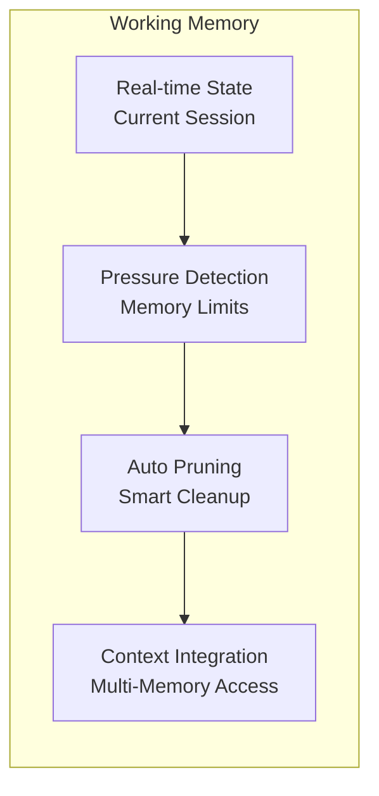

# AxiomKit Core

A powerful TypeScript framework for building intelligent agents with advanced reasoning, memory management, and extensible architecture.

## Overview

AxiomKit Core provides a robust foundation for creating AI agents that can:

- **Reason and Plan**: Chain-of-thought reasoning with customizable thinking patterns
- **Remember and Learn**: Persistent memory with episodic and semantic storage
- **Act and Interact**: Extensible action system with input/output handling
- **Monitor and Debug**: Comprehensive logging and performance tracking
- **Scale and Extend**: Modular architecture with plugin support

## Key Features

- **Advanced Reasoning**: Chain-of-thought processing with customizable thinking patterns
- **Memory Management**: Persistent episodic and semantic memory with vector storage
- **Extensible Actions**: Type-safe action system with schema validation
- **Monitoring**: Built-in performance tracking and request monitoring
-  **Providers Architecture**: Easy scale provider system for custom functionality
- **Context Management**: Sophisticated context handling with state persistence
- **Comprehensive Logging**: Detailed logging with multiple levels and formats


## Architecture
### Memory System


## Installation

```bash
npm install @axiomkit/core
# or
pnpm add @axiomkit/core
# or
yarn add @axiomkit/core
```

## Quick Start

### Basic Agent Setup

```typescript
import { createAgent } from "@axiomkit/core";
import { groq } from "@ai-sdk/groq";

const agent = createAgent({
  model: groq("gemma2-9b-it"),
  modelSettings: {
    maxTokens: 1000,
    temperature: 0.7,
  },
});

// Start the agent
await agent.start();
```

### Creating a Simple Calculator Bot


## Development

### Running Tests

```bash
# Run all tests
pnpm test

# Run with coverage
pnpm test:coverage

# Run with UI
pnpm test:ui
```

### Building

```bash
# Build the package
pnpm build
```

## API Reference

### Core Types

- `Agent<TContext>` - Main agent interface
- `Config<TContext>` - Agent configuration
- `Context<TMemory, Schema, Ctx, Actions, Events>` - Context definition
- `Action<Schema, Result, TError, TContext, TAgent, TMemory>` - Action definition
- `Memory<Data>` - Memory configuration

### Key Methods

- `createAgent(config)` - Create a new agent
- `agent.start(args?)` - Start the agent
- `agent.run(options)` - Run the agent with context
- `agent.send(options)` - Send input to the agent
- `agent.stop()` - Stop the agent


## Contributing

1. Fork the repository
2. Create a feature branch
3. Make your changes
4. Add tests for new functionality
5. Submit a pull request

## License

MIT License - see LICENSE file for details.