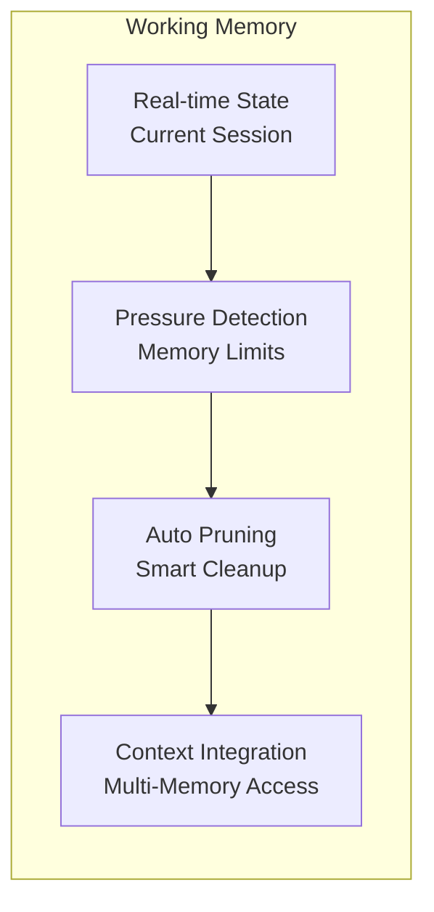

# AxiomKit Core

A powerful TypeScript framework for building intelligent agents with advanced reasoning, memory management, and extensible architecture.

## Overview

AxiomKit Core provides a robust foundation for creating AI agents that can:

- **Reason and Plan**: Chain-of-thought reasoning with customizable thinking patterns
- **Remember and Learn**: Persistent memory with episodic and semantic storage
- **Act and Interact**: Extensible action system with input/output handling
- **Monitor and Debug**: Comprehensive logging and performance tracking
- **Scale and Extend**: Modular architecture with plugin support

## Key Features

- **Advanced Reasoning**: Chain-of-thought processing with customizable thinking patterns
- **Memory Management**: Persistent episodic and semantic memory with vector storage
- **Extensible Actions**: Type-safe action system with schema validation
- **Monitoring**: Built-in performance tracking and request monitoring
-  **Providers Architecture**: Easy scale provider system for custom functionality
- **Context Management**: Sophisticated context handling with state persistence
- **Comprehensive Logging**: Detailed logging with multiple levels and formats


## Architecture
### Memory System


## Installation

```bash
npm install @axiomkit/core
# or
pnpm add @axiomkit/core
# or
yarn add @axiomkit/core
```

## Quick Start

### Basic Agent Setup

```typescript
import { createAgent } from "@axiomkit/core";
import { groq } from "@ai-sdk/groq";

const agent = createAgent({
  model: groq("gemma2-9b-it"),
  modelSettings: {
    maxTokens: 1000,
    temperature: 0.7,
  },
});

// Start the agent
await agent.start();
```

### Creating a Simple Calculator Bot

```typescript
import { createAgent } from "@axiomkit/core";
import { createCliExtension } from "@axiomkit/cli";
import { groq } from "@ai-sdk/groq";

const calculatorExtension = createCliExtension({
  name: "calculator",
  instructions: [
    "You are a mathematical calculator.",
    "When users provide mathematical expressions, calculate the result.",
    "Show your work step by step for complex problems.",
    "Support basic operations: +, -, *, /, ^, sqrt, etc.",
  ],
});

const agent = createAgent({
  model: groq("gemma2-9b-it"),
  modelSettings: {
    maxTokens: 600,
  },
  extensions: [calculatorExtension],
});

async function main() {
  await agent.start();
  console.log("🧮 Calculator Bot started!");
}

main();
```


## Core Concepts

### Agent Configuration

```typescript
const agent = createAgent({
  // Language model
  model: groq("gemma2-9b-it"),
  
  // Model settings
  modelSettings: {
    temperature: 0.7,
    maxTokens: 1000,
    topP: 0.9,
  },
  
  // Memory configuration
  memory: createMemoryStore(),
  
  // Actions available to the agent
  actions: [
    // Your custom actions here
  ],
  
  // Input/Output handlers
  inputs: {
    // Input configurations
  },
  outputs: {
    // Output configurations
  },
  
  // Extensions
  extensions: [
    // Plugin extensions
  ],
});
```

### Context Management

```typescript
import { z } from "zod";

const chatContext = {
  type: "chat",
  schema: z.object({
    userId: z.string(),
    sessionId: z.string(),
  }),
  setup: async (args, settings, agent) => {
    // Initialize context
    return { initialized: true };
  },
  instructions: "You are a helpful assistant in a chat session.",
};

// Use context in agent
const result = await agent.run({
  context: chatContext,
  args: { userId: "user123", sessionId: "session456" },
});
```

### Custom Actions

```typescript
import { z } from "zod";

const searchAction = {
  name: "search",
  description: "Search the web for information",
  schema: z.object({
    query: z.string(),
    maxResults: z.number().optional(),
  }),
  handler: async (args, ctx, agent) => {
    // Implement search logic
    const results = await performSearch(args.query);
    return { results };
  },
};

const agent = createAgent({
  model: groq("gemma2-9b-it"),
  actions: [searchAction],
});
```

### Memory and Persistence

```typescript
import { createMemoryStore } from "@axiomkit/core";

const agent = createAgent({
  model: groq("gemma2-9b-it"),
  memory: createMemoryStore({
    // Configure memory storage
    type: "file", // or "database"
    path: "./memory", // storage location
  }),
});
```

## Advanced Features

### Streaming Responses

```typescript
const result = await agent.run({
  context: chatContext,
  args: { message: "Tell me a story" },
  handlers: {
    onLogStream: (log, done) => {
      if (log.ref === "thought") {
        console.log("🤔 Thinking:", log.content);
      }
      if (log.ref === "output") {
        console.log("💬 Response:", log.content);
      }
    },
  },
});
```

### Request Monitoring

```typescript
const agent = createAgent({
  model: groq("gemma2-9b-it"),
  requestTrackingConfig: {
    enabled: true,
    trackTokens: true,
    trackLatency: true,
  },
});
```

### Training Data Export

```typescript
const agent = createAgent({
  model: groq("gemma2-9b-it"),
  exportTrainingData: true,
  trainingDataPath: "./training-data",
});

// Export all episodes as training data
await agent.exportAllTrainingData("./episodes.json");
```

## Development

### Running Tests

```bash
# Run all tests
pnpm test

# Run with coverage
pnpm test:coverage

# Run with UI
pnpm test:ui
```

### Building

```bash
# Build the package
pnpm build
```

## API Reference

### Core Types

- `Agent<TContext>` - Main agent interface
- `Config<TContext>` - Agent configuration
- `Context<TMemory, Schema, Ctx, Actions, Events>` - Context definition
- `Action<Schema, Result, TError, TContext, TAgent, TMemory>` - Action definition
- `Memory<Data>` - Memory configuration

### Key Methods

- `createAgent(config)` - Create a new agent
- `agent.start(args?)` - Start the agent
- `agent.run(options)` - Run the agent with context
- `agent.send(options)` - Send input to the agent
- `agent.stop()` - Stop the agent


## Contributing

1. Fork the repository
2. Create a feature branch
3. Make your changes
4. Add tests for new functionality
5. Submit a pull request

## License

MIT License - see LICENSE file for details.